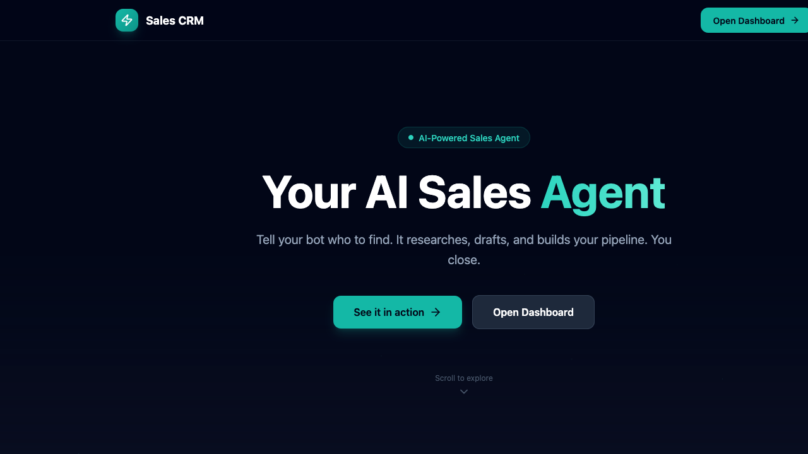
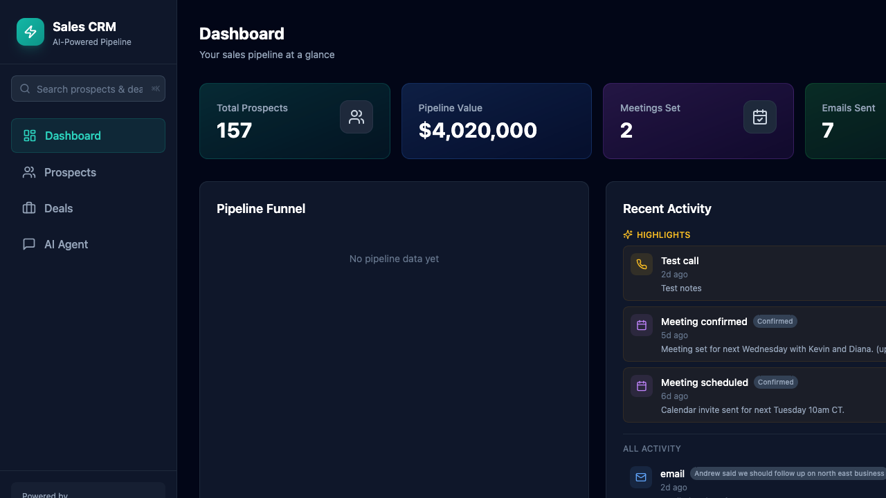
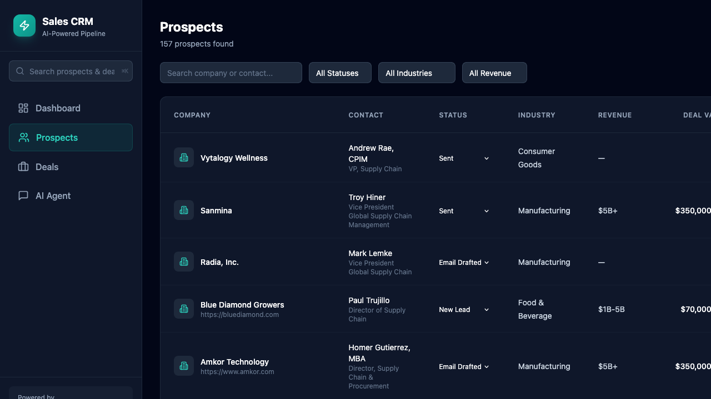
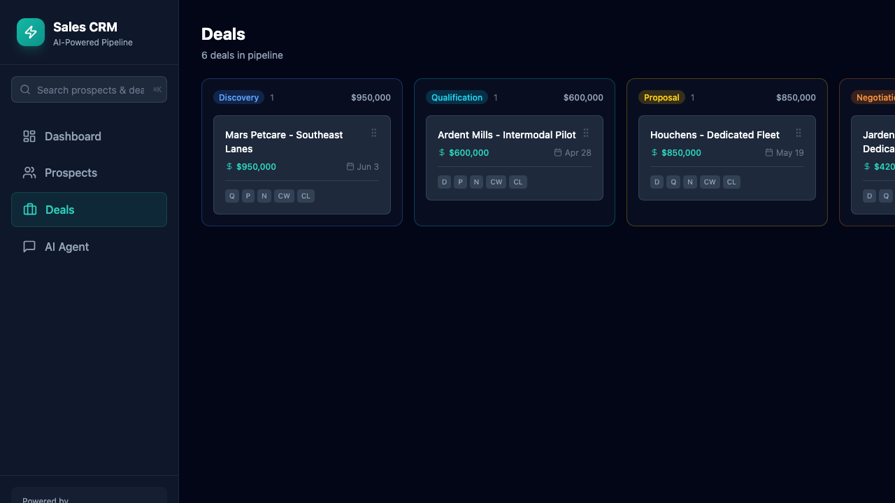
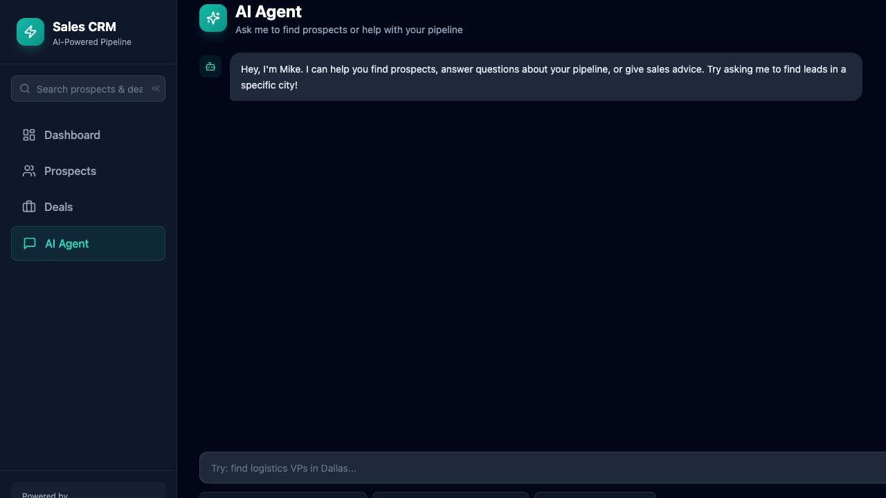

# Hermes CRM

AI-powered sales prospecting CRM built for the Hermes Hackathon. Prospect on the road via messaging, manage the pipeline at your desk.

## What It Does

Hermes CRM connects your AI sales agent to a Notion-backed pipeline manager. The bot researches leads, drafts emails, and logs everything to Notion while you are on the move. The web app gives you a full dashboard, prospect manager, deal kanban, and activity timeline to review, track, and close deals.

## Tech Stack

| Layer | Tech |
|-------|------|
| Backend | FastAPI (Python) |
| Frontend | Next.js 14 + Tailwind CSS |
| Database | Notion (source of truth) |
| Charts | Recharts |
| Icons | Lucide React |

## Features

- **Dashboard** - Pipeline funnel, total value, recent activity, upcoming actions, quick stats
- **Prospects** - Filterable table by status, industry, revenue. Search by company or contact
- **Prospect Detail** - Contact info, research notes, draft email editor, activity timeline, deal creation
- **Deals** - Kanban board by stage with drag-to-advance and per-stage totals
- **AI Agent** - Chat interface backed by OpenRouter for sales coaching and prospect research
- **Global Search** - Quick find across prospects, deals, and activities
- **Voice Dictate** - Speech-to-text input for logging notes and activities

## Screenshots

### Landing Page


### Dashboard


### Prospects


### Deals Kanban


### AI Agent


## Quick Start

### Prerequisites

- Python 3.11+
- Node.js 18+
- Notion integration with a Prospects, Deals, and Activities database
- OpenRouter API key (for AI agent)

### Backend

```bash
cd backend
python -m venv .venv
source .venv/bin/activate
pip install -r requirements.txt

# Set your keys
export NOTION_API_KEY="secret_xxx"
export OPENROUTER_API_KEY="sk-or-xxx"

python main.py
```

Runs on http://localhost:8000

### Frontend

```bash
cd frontend
npm install
npm run dev
```

Runs on http://localhost:3000

## Environment Variables

| Variable | Required | Description |
|----------|----------|-------------|
| `NOTION_API_KEY` | Yes | Notion integration token |
| `OPENROUTER_API_KEY` | Yes | For AI agent chat |
| `NOTION_PROSPECTS_DB_ID` | No | Defaults to built-in ID |
| `NOTION_DEALS_DB_ID` | No | Defaults to built-in ID |
| `NOTION_ACTIVITIES_DB_ID` | No | Defaults to built-in ID |

## API Endpoints

| Method | Path | Description |
|--------|------|-------------|
| GET | `/api/dashboard` | Pipeline stats and summary |
| GET | `/api/prospects` | List prospects with filters |
| GET | `/api/prospects/{id}` | Prospect detail |
| POST | `/api/prospects` | Create prospect |
| PATCH | `/api/prospects/{id}` | Update prospect |
| GET | `/api/deals` | List deals |
| POST | `/api/deals` | Create deal |
| PATCH | `/api/deals/{id}` | Update deal stage |
| GET | `/api/activities` | List activities |
| POST | `/api/activities` | Log activity |
| POST | `/api/agent/chat` | AI agent response |
| GET | `/api/search?q=` | Global search |

## Project Structure

```
├── backend/
│   ├── main.py              # FastAPI app
│   ├── notion.py            # Notion API client
│   ├── config.py            # Env loader
│   ├── models.py            # Pydantic schemas
│   ├── routes/
│   │   ├── prospects.py
│   │   ├── deals.py
│   │   ├── activities.py
│   │   ├── dashboard.py
│   │   ├── search.py
│   │   └── agent.py
│   └── seed_demo.py         # Demo data seeder
├── frontend/
│   ├── src/app/             # Next.js pages
│   └── src/components/      # React components
└── SPEC.md                  # Full build specification
```

## License

MIT
